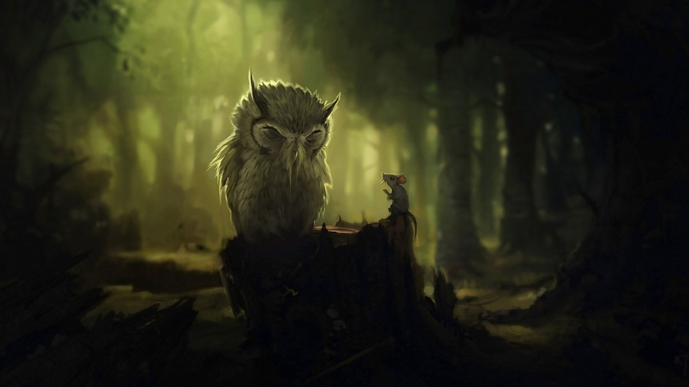

 # Моя инструкция по работе с MarckDown

# Заголовок первого уровня
## Заголовок второго уровня
### Заголовок третьего уровня
#### Заголовок четвёртого уровня
##### Заголовок пятого уровня
###### Заголовок шестого уровня
#
# Работа с текстом

что бы выделить текст полужирным необходимо обромить его двумя звёздочками пример: **текст**

чтобы зачеркнуть текст нужно выделить его двумя волнушками ~~большая вкусная булочка с маком~~

для выделения текста курсивом необходимо обрамить его звёздочками *курсив*

__Жирный__

**тоже жирный**

_курсив_

*тоже курсив*

~~ЗАЧЁРКНУТЫЙ~~

## Можно комбинировать

__жирно__-_курсивный_

~~ГИПЕР~~**БОЛИЧЕСКИЙ***ПАРАБАЛОИД*

# Списки

для разметки неупорядоченных списков можно использовать или `*`, или `-`, или `+`:

- элемент 1
- элемент 2
- элемент 3
* элемент 4
+ элемент 5

Вложенные пункты создаются четырьмя пробелами перед маркером пункта:

* элемент 1
* элемент 2
    * вложенный элемент 2.1
    * вложенный элемент 2.2
* элемент 3

Упорядоченный список:

1. элемент 1
2. элемент 2
    1. вложенный
    2. вложенный
3. элемент 3

не важно как в коде пронумерованы пункты, главное, чтобы перед элементом списка стояла цифра (любая) с точкой. Можно сделать и так:

0. элемент 1
0. элемент 2
0. элемент 3
0. элемент 4

# Тэзисы

* __Тэзис1__  
* __Звёздочка, отступ, текст обрамлённый двойным нижним подчёркиванием.__

    ***раскрываем тэзис*** _раскрываем тэзис_

* __Тэзис 2__   Раскрываем Тэзис


# Цитаты

Цитаты оформляются с помощью символа `>`.

>если б я был султан, я б имел трёх жён
>>неплохо очень иметь три жены, но очень плохо с другой стороны
>>>потому что тёщи тоже три
# Ссылки

[Булочка с маком](https://memepedia.ru/wp-content/uploads/2017/12/hqdefault.jpg)

[Московская булочка][1], [Ярославская булочка][2], [Уренгойский торт][3].

[1]: https://maestro-foods.ru/images/bulochka-moskovskaya.jpg
[2]: https://lh3.googleusercontent.com/proxy/MKqvRWsT2HrQkqh2qtl-D48FFdsUXdEo4_fgJSHyI9zk3nSC6WRV4r5KgCFzQBv8Hhh_WSaqRDIPr4V0hv8Tq-aVYYeGRDUAiQu6dBHJsWRSfqg3nj6Tr7YaNyt1rLl5sjsAbRlyCxag1j9yjJ42Zo6C7of3UAHx3InUn0XrZlJ3xw
[3]: https://lh3.googleusercontent.com/proxy/XbmEmIHSPzZ6F9PlUUqmAAjiMAVpwhVpUbbIXAs2BjI78njcF4kqSYPzh4sH8frwtO0khCm57IxSYJOwg7tuxFHEmuK4JdnvcrXJh-iQ_gSd

# Изображения
что бы вставить изображение в текст достаточно сделать следующее:


# 

# Таблица

первый столбик | второй столбик
-------------- | -------------
булочка        | с маком
чай            | с сахаром
макароны       | c сосиской

# Инлайн-код: `print("Hello, World!")`

Код на Python:

```python

x = int(input())

if x > 0:

    print(x)

else:

    print(-x)

``` 

#
# THE END #